# Richard Ivan

Full-stack developer with 5+ years building web systems. MS Computer Science at NTUST, Taiwan. Based in Indonesia.

Most of my work is in Next.js, TypeScript, and PostgreSQL. I care about software that keeps working after the demo.

### Stack

|              |                             |
| ------------ | --------------------------- |
| **Frontend** | Next.js, React, TypeScript  |
| **Backend**  | Node.js, Prisma, PostgreSQL |
| **Tooling**  | Docker, Git                 |

### Stats

 

### Contact

[xefyn.com](https://xefyn.com) · [LinkedIn](https://www.linkedin.com/in/richard-ivan-5149b71a2/) · [Telegram](https://t.me/Xefyn) · [Discord](https://discord.com/users/332374259026493441)
