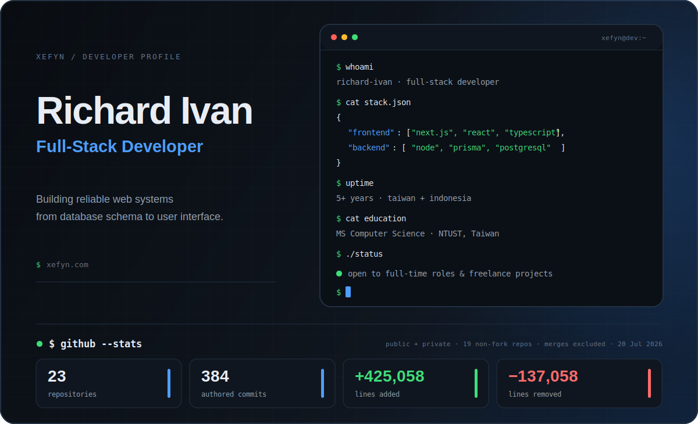

<picture>
  <source media="(max-width: 600px)" srcset="profile/hero-mobile.svg" />
  
</picture>

 

 

Full-stack developer with **5+ years of experience across Taiwan and Indonesia** and an **MS in Computer Science from NTUST**. I build reliable web systems from database schema to user interface, primarily with Next.js, React, TypeScript, Java, Spring, Kafka, and PostgreSQL.

